# 🧑🏾‍💻 Section 06

## 📚 Lecture 069: Starting a New Project: The "Far Away" Travel List


### 1. create React project:
```bash
npm create vite@latest 04-steps
react
javascript
npm
```

### 2. Load this React project:

```bash
npm run dev
```

### 3. Clean/delete unnecessary files:

```
05-travel-list/
├── node_modules/
├── public/
├── src/
│   ├── components/
│   │   └── ????.jsx
│   ├── App.jsx
│   └── main.jsx
├── .eslint.config.js
├── index.html
├── package-lock.json
├── package.json
├── README.md
└── vite.config.js
```

## 📚 Lecture 070: Building the Layout

### 1. copy **`index.css`** file:
```css
/* 
const initialItems = [
  { id: 1, description: "Passports", quantity: 2, packed: false },
  { id: 2, description: "Socks", quantity: 12, packed: false },
];
*/

@import url("https://fonts.googleapis.com/css2?family=Monoton&family=Quicksand:wght@500;700&display=swap");

* {
  margin: 0;
  padding: 0;
  box-sizing: border-box;
}

html {
  font-size: 62.5%;
}

body {
  font-size: 2.4rem;
  font-family: sans-serif;
  color: #5a3e2b;
  font-family: "Quicksand";
  font-weight: 500;
}

.app {
  width: 100%;
  height: 100vh;
  display: grid;
  grid-template-rows: auto auto 1fr auto;
}

h1 {
  text-align: center;
  background-color: #f4a226;
  font-family: "Monoton";
  font-size: 8rem;
  text-transform: uppercase;
  font-weight: 400;
  word-spacing: 30px;
  letter-spacing: -5px;
  padding: 2.4rem 0;
}

.add-form {
  background-color: #e5771f;
  padding: 2.8rem 0;
  display: flex;
  align-items: center;
  justify-content: center;
  gap: 0.8rem;
}

h3 {
  margin-right: 1.6rem;
  font-size: 2.4rem;
}

button,
select,
input {
  background-color: #ffebb3;
  color: #5a3e2b;
  font-family: inherit;
  border: none;
  border-radius: 10rem;
  padding: 1.2rem 3.2rem;
  font-weight: 700;
  font-size: 1.8rem;
  cursor: pointer;
}

.add-form button {
  text-transform: uppercase;
  background-color: #76c7ad;
}

.list {
  background-color: #5a3e2b;
  color: #ffebb3;
  padding: 4rem 0;

  display: flex;
  justify-content: space-between;
  flex-direction: column;
  gap: 3.2rem;
  align-items: center;
}

.actions button,
.list select {
  text-transform: uppercase;
  padding: 0.8rem 2.4rem;
  font-size: 1.4rem;
  font-weight: 700;
  margin: 0 0.8rem;
}

.list ul {
  list-style: none;
  width: 80%;
  overflow: scroll;

  display: grid;
  grid-template-columns: repeat(auto-fit, minmax(250px, 1fr));
  gap: 1.2rem;
  justify-content: center;
  align-content: start;
}

.list li {
  display: flex;
  align-items: center;
  gap: 1.2rem;
}

input[type="checkbox"] {
  height: 2rem;
  width: 2rem;
  accent-color: #e5771f;
}

.list li button {
  cursor: pointer;
  background: none;
  border: none;
  font-size: 1.8rem;
  padding: 0.8rem;
  transform: translateY(2px);
}

.stats {
  background-color: #76c7ad;
  text-align: center;
  font-weight: 700;
  padding: 3.2rem 0;
}
```

### 2. Delete all **`App.jsx`** file content and add:
```
05-travel-list/
├── node_modules/
├── public/
├── src/
│   ├── components/             ✅
│   │   ├── Form.jsx            ✅
│   │   ├── Logo.jsx            ✅
│   │   ├── PackingList.jsx     ✅
│   │   └── Stats.jsx           ✅
│   ├── App.jsx
│   └── main.jsx
├── .eslint.config.js
├── index.html
├── package-lock.json
├── package.json
├── README.md
└── vite.config.js
```

### 3. Add the following content for each component:
1. **`App.jsx`**
```jsx
// ./src/App.jsx
import Logo from "./components/Logo";
import Form from "./components/Form";
import PackingList from "./components/PackingList";
import Stats from "./components/Stats";
const App = () => {
  return (
    <div className="app">
      <Logo />
      <Form />
      <PackingList />
      <Stats />
    </div>
  );
};
export default App; 
```

2. **`Logo.jsx`**:
```jsx
const Logo = () => {
  return <h1>🌴 Far Away 💼</h1>;
};
export default Logo;
```

3. **`Form.jsx`**:
```jsx
const Form = () => {
  return (
    <div className="add-form">
      <h3>What do you neeed for 😍 your trip?</h3>
    </div>
  );
};
export default Form;
```

4. **`PackingList.jsx`**:
```jsx
const PackingList = () => {
  return (
    return <div className="list">LIST</div>;
  );
};
export default PackingList;
```

5. **`Stats.jsx`**:
```jsx
const Stats = () => {
    <footer className="stats">
        <em> 💼 You have X items on your list, and you already packed X (X%)</em>
    </footer>
export default Stats;
```
### 4.  Execute the following command: 
```bash
npm run dev
```

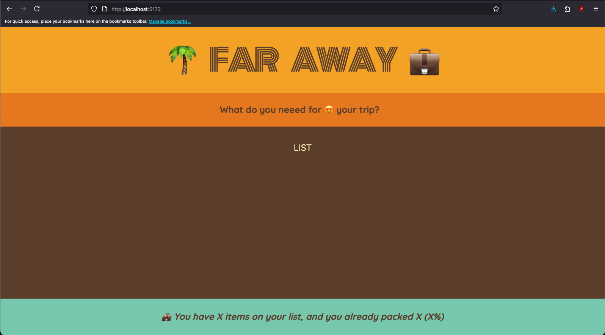

## 📚 Lecture 071: Rendering the Items List

### 1. Copy the `initialItems` array from **`index.css`** and paste it on **`PackingList.jsx`** file:
```jsx
const initialItems = [
  { id: 1, description: "Passports", quantity: 2, packed: false },
  { id: 2, description: "Socks", quantity: 12, packed: false },
];
const PackingList = () => {
  return <div className="list">LIST</div>;
};
export default PackingList;
```

### 2. Create **`Item`** component:
```jsx
// ./src/components/Item.jsx
const Item = ({ item }) => {
  return <li>{item.description}</li>;
};
export default Item;
```

### 3. Coming back **`PackingList`** component, apply the **`map`** method:
```jsx
const initialItems = [
  { id: 1, description: "Passports", quantity: 2, packed: false },
  { id: 2, description: "Socks", quantity: 12, packed: false },
];
const PackingList = () => {
  return (
    <div className="list">
      <ul>
        {initialItems.map((item) => (<Item item={item} />))}
      </ul>
    </div>
  )
};
export default PackingList;
```
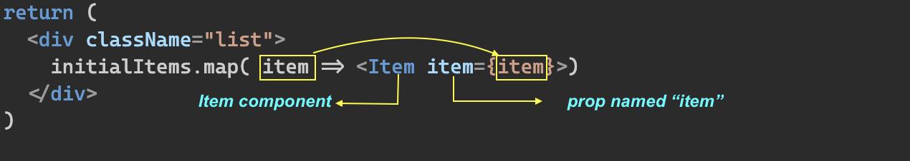


### 4. Update **`Item`** component:
```jsx
const Item = ({ item }) => {
  return (
    <li>
      <span>
        {item.quantity} {item.description}
      </span>
      <button>❌</button>
    </li>
  )
};
export default Item;
```

### 5. Update **`Item`** style:
```jsx
const Item = ({ item }) => {
  return (
    <li>
      <span style={item.packed ? {textDecoration : "line-through"} : {}}>
        {item.quantity} {item.description}
      </span>
      <button>❌</button>
    </li>
  )
};
export default Item;
```

## 📚 Lecture 072: Building a Form and Handling Submissions

### 1. Working with **`Form`** component:
```jsx
const Form = () => {
  return (
    <form className="add-form">
      <h3>What do you neeed for 😍 your trip?</h3>
      <select>
        <option value="1">1</option>
        <option value="2">2</option>
        <option value="3">3</option>
      </select>
      <input type="text" placeholder="Item..." />
      <button>Add</button>
    </form>
  );
};
export default Form;
```
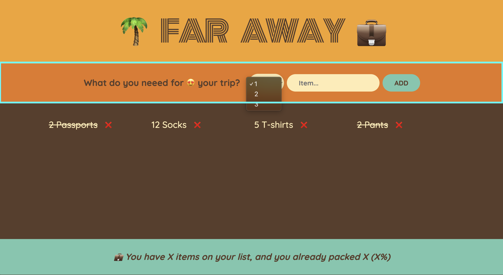

### 2. Enhance the select option values:
```jsx
const Form = () => {
  return (
    <form className="add-form">
      <h3>What do you neeed for 😍 your trip?</h3>
      <select>
        {/*<option value="1">1</option>
        <option value="2">2</option>
        <option value="3">3</option>*/}
        {Array.from({ length: 20 }, (_, i) => i + 1).map((num) => (
          <option value={num} key={num}>
            {num}
          </option>
        ))}
      </select>
      <input type="text" placeholder="Item..." />
      <button>Add</button>
    </form>
  );
};
export default Form;
```
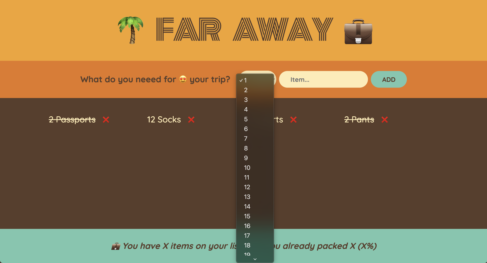

### 3. Create **`handleSubmit`** function:
```jsx
const Form = () => {
  const handleSubmit = (e) => {
    e.preventDefault();
    console.log("hello from FORM component!!");
    console.log(e);
  };
  return (
    <form className="add-form" onSubmit={handleSubmit}>
      <h3>What do you neeed for 😍 your trip?</h3>
      <select>
        {/*<option value="1">1</option>
        <option value="2">2</option>
        <option value="3">3</option>*/}
        {Array.from({ length: 20 }, (_, i) => i + 1).map((num) => (
          <option value={num} key={num}>
            {num}
          </option>
        ))}
      </select>
      <input type="text" placeholder="Item..." />
      <button>Add</button>
    </form>
  );
};
export default Form;
```

## 📚 Lecture 073: Controlled Elements

### 1. Make React controls the **`input field`** instead of the DOM:
```jsx
// ./src/components/Form.jsx
import { useState } from "react";  // 👈🏽 ✅
const Form = () => {
  const [description, setDescription] = useState("test");  // 👈🏽 ✅
  const handleSubmit = (e) => {
    e.preventDefault();
    console.log(e);
  };
  return (
    <form className="add-form" onSubmit={handleSubmit}>
      <h3>What do you neeed for 😍 your trip?</h3>
      <select>
        {Array.from({ length: 20 }, (_, i) => i + 1).map((num) => (
          <option value={num} key={num}>
            {num}
          </option>
        ))}
      </select>
      <input type="text" placeholder="Item..." value={description} />  {/* 👈🏽 ✅ */}
      <button>Add</button>
    </form>
  );
};
export default Form;
```
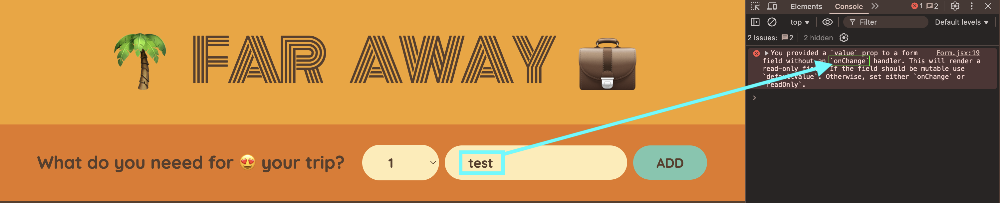

In ordert control input changes:

```jsx
// ./src/components/Form.jsx
import { useState } from "react";
const Form = () => {
  const [description, setDescription] = useState("test");
  const handleSubmit = (e) => {
    e.preventDefault();
    console.log(e);
  };
  return (
    <form className="add-form" onSubmit={handleSubmit}>
      <h3>What do you neeed for 😍 your trip?</h3>
      <select>
        {Array.from({ length: 20 }, (_, i) => i + 1).map((num) => (
          <option value={num} key={num}>
            {num}
          </option>
        ))}
      </select>
      <input 
        type="text" 
        placeholder="Item..." 
        value={description} 
        onChange={ (e) => setDescription(e.target.value)}
      />  {/* 👈🏽 ✅ */}
      <button>Add</button>
    </form>
  );
};
export default Form;
```

### 2. Make React has control of **`select`** value:
```jsx
import { useState } from "react";
const Form = () => {
  const [description, setDescription] = useState("test");
  const [quantity, setQuantity] = useState(1);
  const handleSubmit = (e) => {
    e.preventDefault();
    console.log(e);
  };
  return (
    <form className="add-form" onSubmit={handleSubmit}>
      <h3>What do you neeed for 😍 your trip?</h3>
      <select value={quantity} onChange={(e) => setQuantity(Number(e.target.value))}>
        {Array.from({ length: 20 }, (_, i) => i + 1).map((num) => (
          <option value={num} key={num}>
            {num}
          </option>
        ))}
      </select>
      <input type="text" placeholder="Item..." value={description} onChange={(e) => setDescription(e.target.value)} />
      <button>Add</button>
    </form>
  );
};
export default Form;
```

Note:
1. Take a look at  **`Components`** extension.
2. The select code could be at first:
    ```jsx
    <select value={quantity} onChange={(e) => setQuantity(e.target.value)}>
    ```
    So the returned value would be a **`string`** instead of a **`number`**, that's why the casting is mandatory from the previous one to:
    ```jsx
    <select value={quantity} onChange={(e) => setQuantity(Number(e.target.value))}>
    ```

### 3. Working with the **`handleSubmit`** function:
#### 1. Create a new Item:
```jsx
import { useState } from "react";
const Form = () => {
  const [description, setDescription] = useState("test");
  const [quantity, setQuantity] = useState(1);
  const handleSubmit = (e) => {
    e.preventDefault();
    const newItem = { description, quantity, packed: false, id: Date.now() };  // 👈🏽✅
    console.log(newItem);  // 👈🏽✅
  };
  return (
    <form className="add-form" onSubmit={handleSubmit}>
      <h3>What do you neeed for 😍 your trip?</h3>
      <select value={quantity} onChange={(e) => setQuantity(Number(e.target.value))}>
        {Array.from({ length: 20 }, (_, i) => i + 1).map((num) => (
          <option value={num} key={num}>
            {num}
          </option>
        ))}
      </select>
      <input type="text" placeholder="Item..." value={description} onChange={(e) => setDescription(e.target.value)} />
      <button>Add</button>
    </form>
  );
};
export default Form;
```
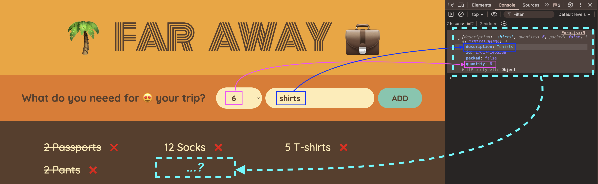


#### 2. As you can see, there are two big issues from the previous image:

1. quantituy dropdown and item input are not back to theeir initial vaues/state.

2. The brand new item is not added inside the packing list.

### 4. Fixing the quantity dropdwon and item input field issue:
```jsx
import { useState } from "react";
const Form = () => {
  const [description, setDescription] = useState("test");
  const [quantity, setQuantity] = useState(1);
  const handleSubmit = (e) => {
    e.preventDefault();
    if (!description) return;  // 👈🏽 ✅ no description => no submit anything
    const newItem = { description, quantity, packed: false, id: Date.now() };
    console.log(newItem);
    setDescription("");  // 👈🏽 ✅ come back to its initial value/state.
    setQuantity(1);  // 👈🏽 ✅ come back to its initial value/state.
  };
  return (
    <form className="add-form" onSubmit={handleSubmit}>
      <h3>What do you neeed for 😍 your trip?</h3>
      <select value={quantity} onChange={(e) => setQuantity(Number(e.target.value))}>
        {Array.from({ length: 20 }, (_, i) => i + 1).map((num) => (
          <option value={num} key={num}>
            {num}
          </option>
        ))}
      </select>
      <input type="text" placeholder="Item..." value={description} onChange={(e) => setDescription(e.target.value)} />
      <button>Add</button>
    </form>
  );
};
export default Form;
```
Remaining Issue:
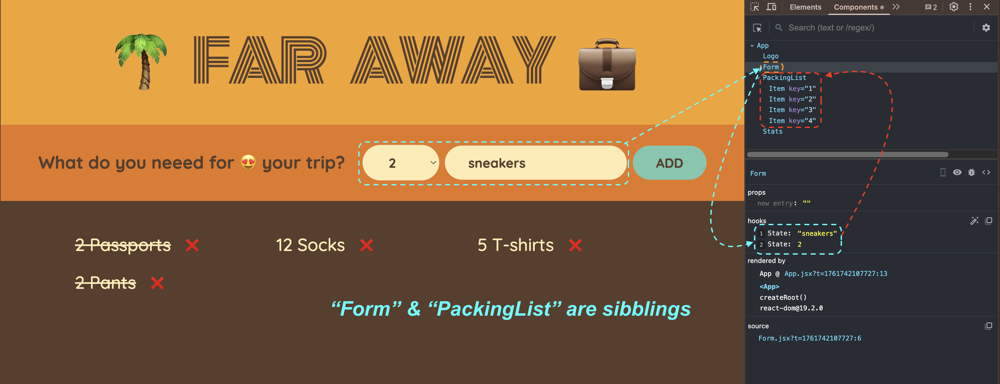


## 📚 Lecture 074: State vs. Props

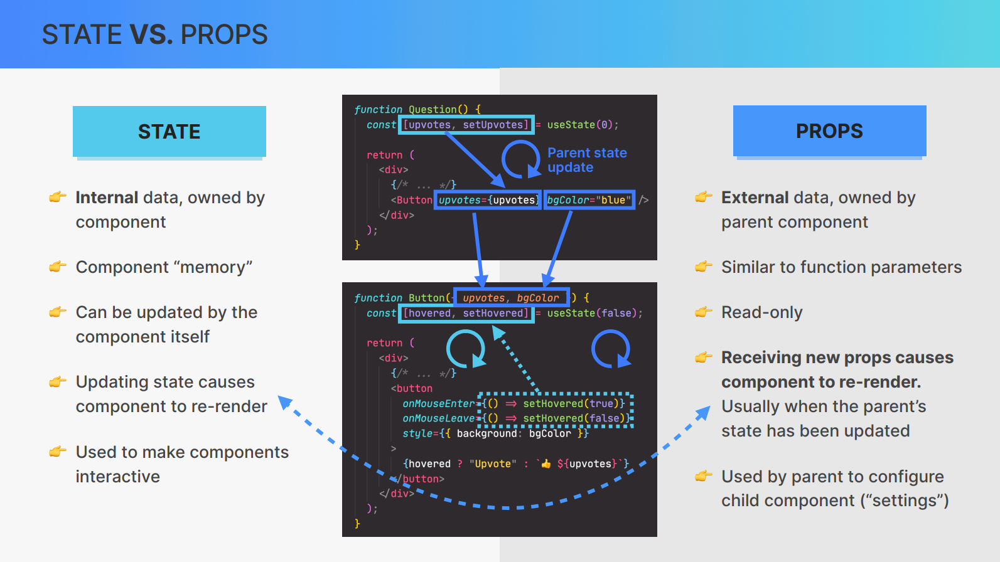


# 🧑🏾‍💻 Section 07: Thinking in React: State Management

## 📚 Lecture 080: Thinking about State and Lifting State up.

### 1. Working on Form:
```js
import { useState } from "react";

const Form = () => {
  const [description, setDescription] = useState("");
  const [quantity, setQuantity] = useState(1);
  const [items, setItems] = useState([]);

  const handleAddItems = (newItem) => {
    setItems((items) => [...items, newItem]);
    console.log(items);
  };  // 👈🏽 ✅
  const handleSubmit = (e) => {
    e.preventDefault();
    if (!description) return;
    const newItem = { description, quantity, packed: false, id: Date.now() };
    console.log(newItem);

    //create a function to add this new item to the packing list
    handleAddItems(newItem);  // 👈🏽 ✅
    setDescription("");
    setQuantity(1);
  };
  return (
    <form className="add-form" onSubmit={handleSubmit}>
      <h3>What do you neeed for 😍 your trip?</h3>
      <select value={quantity} onChange={(e) => setQuantity(Number(e.target.value))}>
        {Array.from({ length: 20 }, (_, i) => i + 1).map((num) => (
          <option value={num} key={num}>
            {num}
          </option>
        ))}
      </select>
      <input type="text" placeholder="Item..." value={description} onChange={(e) => setDescription(e.target.value)} />
      <button>Add</button>
    </form>
  );
};
export default Form;
```

Isue: Lift State up:

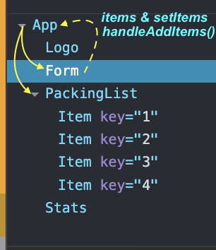

### 2. Move **`[items, setItems] = useState([])`** to **`App.js`**

```jsx
// ./src/App.jsx
import Logo from "./components/Logo";
import Form from "./components/Form";
import PackingList from "./components/PackingList";
import Stats from "./components/Stats";
import { useState } from "react";
const App = () => {
  const [items, setItems] = useState([]); //👈🏽 ✅
  return (
    <div className="app">
      <Logo />
      <Form />
      <PackingList items={items} /> //👈🏽 ✅
      <Stats />
    </div>
  );
};
export default App;
```
PackingList component:
```jsx
// ./src/components/PackingList.jsx
import Item from "./Item";
const PackingList = ({ items }) => { // 👈🏽 ✅
  return (
    <div className="list">
      <ul>
        {items.map((item) => ( // 👈🏽 ✅
          <Item item={item} key={item.id} />
        ))}
      </ul>
    </div>
  );
};
export default PackingList;
```

### 3. Move **`handleAddItems()`** functin moves to **`App.jsx`**:
```jsx
// ./src/App.jsx
import Logo from "./components/Logo";
import Form from "./components/Form";
import PackingList from "./components/PackingList";
import Stats from "./components/Stats";
import { useState } from "react";
const App = () => {
  const [items, setItems] = useState([]);
  const handleAddItems = (newItem) => { // 👈🏽 ✅
    setItems((items) => [...items, newItem]);
    console.log(items);
  }; 
  return (
    <div className="app">
      <Logo />
      <Form onAddItems={handleAddItems} /> // 👈🏽 ✅
      <PackingList items={items} />
      <Stats />
    </div>
  );
};
export default App;
```

Update **`Form.jsx`**:
```jsx
import { useState } from "react";
const Form = ({ onAddItems }) => { // 👈🏽 ✅
  const [description, setDescription] = useState("");
  const [quantity, setQuantity] = useState(1);
  //const [items, setItems] = useState([]);
  /*
  const handleAddItems = (newItem) => {
    setItems((items) => [...items, newItem]);
    console.log(items);
  };
  */
  const handleSubmit = (e) => {
    e.preventDefault();
    if (!description) return;
    const newItem = { description, quantity, packed: false, id: Date.now() };
    console.log(newItem);
    //create a function to add this new item to the packing list
    onAddItems(newItem); // 👈🏽 ✅
    setDescription("");
    setQuantity(1);
  };
  return (
    <form className="add-form" onSubmit={handleSubmit}>
      <h3>What do you neeed for 😍 your trip?</h3>
      <select value={quantity} onChange={(e) => setQuantity(Number(e.target.value))}>
        {Array.from({ length: 20 }, (_, i) => i + 1).map((num) => (
          <option value={num} key={num}>
            {num}
          </option>
        ))}
      </select>
      <input type="text" placeholder="Item..." value={description} onChange={(e) => setDescription(e.target.value)} />
      <button>Add</button>
    </form>
  );
};
export default Form;
```

## 📚 Lecture 081: Reviewing "Lifting Up State"

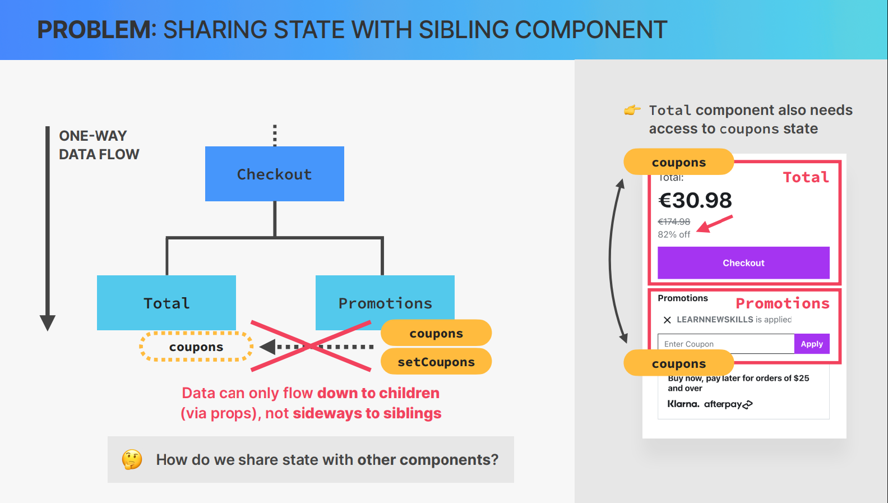
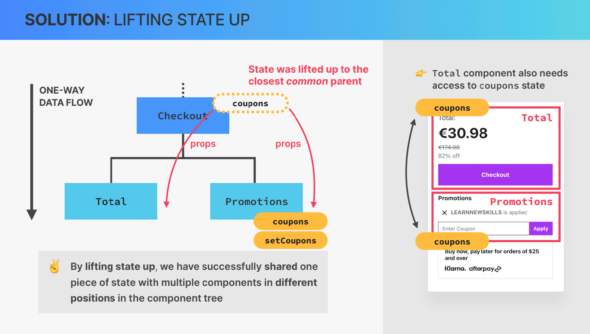
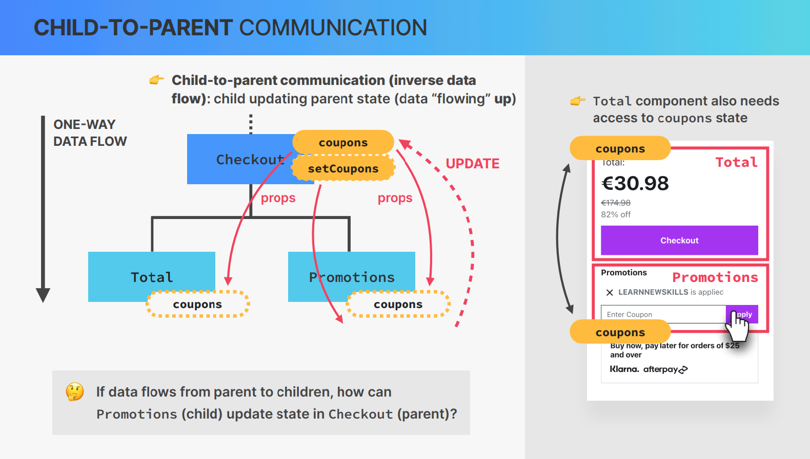


## 📚 Lecture 082: Deleting an Item: More Child-to-Parent Communication!

### 1. Same as previous situation, **`App.jsx`** must have the **`handleDeleteItem`** function.
```jsx
// ./src/App.jsx
import Logo from "./components/Logo";
import Form from "./components/Form";
import PackingList from "./components/PackingList";
import Stats from "./components/Stats";
import { useState } from "react";
const App = () => {
  const [items, setItems] = useState([]);
  const handleAddItems = (newItem) => {
    setItems((items) => [...items, newItem]);
    console.log(items);
  };
  const handleDeleteItem = (id) => { // 👈🏽 ✅
    setItems((items) => items.filter((item) => item.id !== id));
  };
  return (
    <div className="app">
      <Logo />
      <Form onAddItems={handleAddItems} />
      <PackingList items={items} onDeleteItem={handleDeleteItem} /> // 👈🏽 ✅
      <Stats />
    </div>
  );
};
export default App;
```

> This onDeleteItem was send as props to **`PackingList`** 

### 2. Working with **`PackingList.jsx`** with the **`onDeleteItem`** as props:
```jsx
// ./src/components/PackingList.jsx
import Item from "./Item";
const PackingList = ({ items, onDeleteItem }) => {  // 👈🏽 ✅
  return (
    <div className="list">
      <ul>
        {items.map((item) => (
          <Item item={item} nDeleteItem={onDeleteItem} key={item.id} />  // 👈🏽 ✅
        ))}
      </ul>
    </div>
  );
};
export default PackingList;
```

> This **`onDeleteItem`** is sent as props into **`Item.jsx`**

### 3. Working on **`Item.jsx`**:
```jsx
// ./src/components/Item.jsx
const Item = ({ item, onDeleteItem }) => {  // 👈🏽 ✅
  return (
    <li>
      <span style={item.packed ? { textDecoration: "line-through" } : {}}>
        {item.quantity} {item.description}
      </span>
      <button onClick={onDeleteItem}>❌</button>  // 👈🏽 ✅
    </li>
  );
};
export default Item;
```

> Notice:

- However when user clicks on **`<button onClick={onDeleteItem}>❌</button>`** noting happens

- Beside, need to send the **`ID`** as parameter inside the onDeleteItem.

```jsx
const Item = ({ item, onDeleteItem }) => {
  return (
    <li>
      <span style={item.packed ? { textDecoration: "line-through" } : {}}>
        {item.quantity} {item.description}
      </span>
      <button onClick={() => onDeleteItem(item.id)}>❌</button>  // 👈🏽 ✅
    </li>
  );
};
export default Item;
```

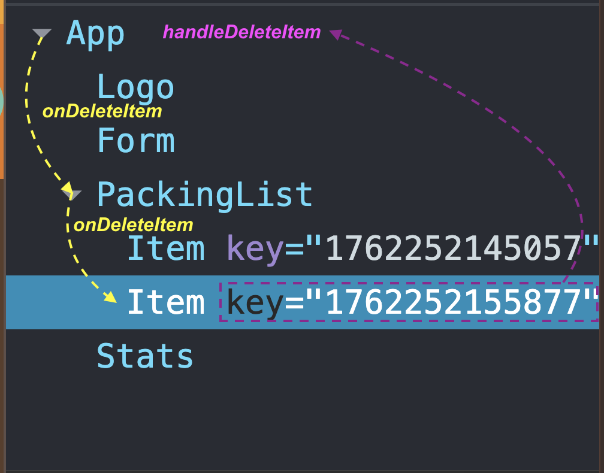


## 📚 Lecture 083: Updating an Item: Complex Immutable Data Operation 

### 1. Working on **`Item`** component - adding a checkbox input:
```jsx
const Item = ({ item, onDeleteItem }) => {
  return (
    <li>
      <input type="checkbox" value={item.packed} onChange={() => {}} />
      <span style={item.packed ? { textDecoration: "line-through" } : {}}>
        {item.quantity} {item.description}
      </span>
      <button onClick={() => onDeleteItem(item.id)}>❌</button>
    </li>
  );
};

export default Item;
```

### 2. **`Item`** modification starts from **`App`** component:

The principle of **`“Lifting State Up”`** => **`handleToggleItem`** is in **`App.jsx`** because:
- The items state lives in App.jsx
```jsx
const [items, setItems] = useState([]);
```

- In React, only the component that owns the state can modify it directly.
- Since items is in App.jsx, the functions that modify it must also be in that same component.

```jsx
// ./src/App.jsx
import Logo from "./components/Logo";
import Form from "./components/Form";
import PackingList from "./components/PackingList";
import Stats from "./components/Stats";
import { useState } from "react";
const App = () => {
  const [items, setItems] = useState([]);
  const handleAddItems = (newItem) => {
    setItems((items) => [...items, newItem]);
    console.log("handleAddItems: ", items);
  };
  const handleDeleteItem = (id) => {
    setItems((items) => items.filter((item) => item.id !== id));
  };
  const handleToggleItem = (id) => {  // 👈🏽 ✅
    setItems((items) => items.map((item) => (item.id === id ? { ...item, packed: !item.packed } : item)));
  };  // 👈🏽 ✅
  return (
    <div className="app">
      <Logo />
      <Form onAddItems={handleAddItems} />
      <PackingList items={items} onDeleteItem={handleDeleteItem} onToggleItem={handleToggleItem} />  // 👈🏽 ✅
      <Stats />
    </div>
  );
};
export default App;
```

### 3. Sending **`onToggleItem`** props to **`PackingList`**:
```jsx
// ./src/components/PackingList
import Item from "./Item";
const PackingList = ({ items, onDeleteItem, onToggleItem }) => {  // 👈🏽 ✅
  return (
    <div className="list">
      <ul>
        {items.map((item) => (
          <Item item={item} onDeleteItem={onDeleteItem} key={item.id} onToggleItem={onToggleItem} />  // 👈🏽 ✅
        ))}
      </ul>
    </div>
  );
};
export default PackingList;
```

### 4. Sending **`onToggleItem`** props to **`Item`**:
```jsx
// ./src/components/Item.jsx
const Item = ({ item, onDeleteItem, onToggleItem }) => {  // 👈🏽 ✅
  return (
    <li>
      <input type="checkbox" value={item.packed} onChange={() => onToggleItem(item.id)} />  // 👈🏽 ✅
      <span style={item.packed ? { textDecoration: "line-through" } : {}}>
        {item.quantity} {item.description}
      </span>
      <button onClick={() => onDeleteItem(item.id)}>❌</button>
    </li>
  );
};
export default Item;
```


## 📚 Lecture 0
## 📚 Lecture 0